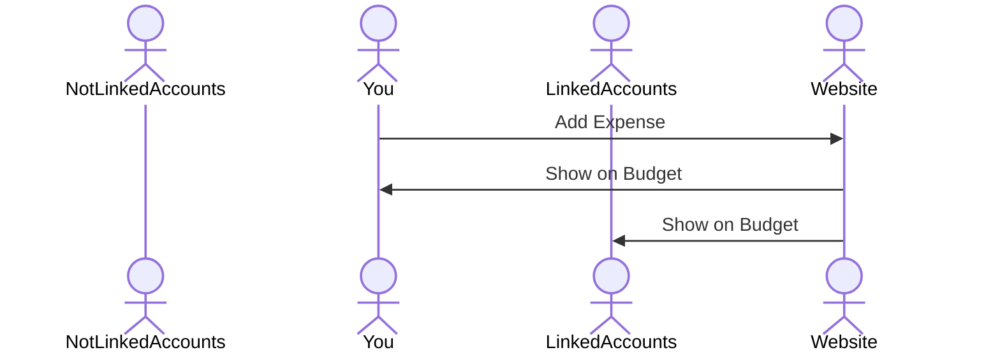

# Budget Friend

[My Notes](notes.md)

A super cool budget app will be made in this repo!

> [!NOTE]
>  This is a template for your startup application. You must modify this `README.md` file for each phase of your development. You only need to fill in the section for each deliverable when that deliverable is submitted in Canvas. Without completing the section for a deliverable, the TA will not know what to look for when grading your submission. Feel free to add additional information to each deliverable description, but make sure you at least have the list of rubric items and a description of what you did for each item.

> [!NOTE]
>  If you are not familiar with Markdown then you should review the [documentation](https://docs.github.com/en/get-started/writing-on-github/getting-started-with-writing-and-formatting-on-github/basic-writing-and-formatting-syntax) before continuing.

## 🚀 Specification Deliverable

> [!NOTE]
>  Fill in this sections as the submission artifact for this deliverable. You can refer to this [example](https://github.com/webprogramming260/startup-example/blob/main/README.md) for inspiration.

For this deliverable I did the following. I checked the box `[x]` and added a description for things I completed.

- [ ] Proper use of Markdown
- [ ] A concise and compelling elevator pitch
- [ ] Description of key features
- [ ] Description of how you will use each technology
- [ ] One or more rough sketches of your application. Images must be embedded in this file using Markdown image references.

### Elevator pitch

Budget Friend is a website that will make budgeting simpler and more user friendly. Having tried multiple different ways of budgeting I decided that it was time for something new. The website will have a simple home page that will allow you to see your budget, edit categories, add an expense, and connect accounts with people. Connecting accounts will allow your expenses to show up in other budgets. The one home page will allow for easy access to all of the information needed when looking at a budget.

### Design

The design will be clean with action buttons at the top and then information about the budget further down the page with every expense for the last 2 months at the bottom.

### Key features

- Account linking with other people by sending them a request to their account.
- Add expenses.
- Add and edit categories.
- Send an email to update people about their budget.

### Technologies

I am going to use the required technologies in the following ways.

- **HTML** - A sign in page and a home page will be added.
- **CSS** - A clean layout with colors that makek it easy to look at.
- **React** - Buttons to add budget items will be used.
- **Service** - Log in, retrieve expenses, retrieve specific budget items, submit category changes, submit expenses, and use gmail API to automate updates [Gmail API](https://developers.google.com/workspace/gmail/api/guides)
- **DB/Login** - Budget categories and budget items will be saved in the database based on login info.
- **WebSocket** - The accounts will be able to be connected so budget items will be added to your page if a linked budget adds them.

## 🚀 AWS deliverable

For this deliverable I did the following. I checked the box `[x]` and added a description for things I completed.

- [ ] **Server deployed and accessible with custom domain name** - [My server link](https://yourdomainnamehere.click).

## 🚀 HTML deliverable

For this deliverable I did the following. I checked the box `[x]` and added a description for things I completed.

- [ ] **HTML pages** - I did not complete this part of the deliverable.
- [ ] **Proper HTML element usage** - I did not complete this part of the deliverable.
- [ ] **Links** - I did not complete this part of the deliverable.
- [ ] **Text** - I did not complete this part of the deliverable.
- [ ] **3rd party API placeholder** - I did not complete this part of the deliverable.
- [ ] **Images** - I did not complete this part of the deliverable.
- [ ] **Login placeholder** - I did not complete this part of the deliverable.
- [ ] **DB data placeholder** - I did not complete this part of the deliverable.
- [ ] **WebSocket placeholder** - I did not complete this part of the deliverable.

## 🚀 CSS deliverable

For this deliverable I did the following. I checked the box `[x]` and added a description for things I completed.

- [ ] **Header, footer, and main content body** - I did not complete this part of the deliverable.
- [ ] **Navigation elements** - I did not complete this part of the deliverable.
- [ ] **Responsive to window resizing** - I did not complete this part of the deliverable.
- [ ] **Application elements** - I did not complete this part of the deliverable.
- [ ] **Application text content** - I did not complete this part of the deliverable.
- [ ] **Application images** - I did not complete this part of the deliverable.

## 🚀 React part 1: Routing deliverable

For this deliverable I did the following. I checked the box `[x]` and added a description for things I completed.

- [ ] **Bundled using Vite** - I did not complete this part of the deliverable.
- [ ] **Components** - I did not complete this part of the deliverable.
- [ ] **Router** - I did not complete this part of the deliverable.

## 🚀 React part 2: Reactivity deliverable

For this deliverable I did the following. I checked the box `[x]` and added a description for things I completed.

- [ ] **All functionality implemented or mocked out** - I did not complete this part of the deliverable.
- [ ] **Hooks** - I did not complete this part of the deliverable.

## 🚀 Service deliverable

For this deliverable I did the following. I checked the box `[x]` and added a description for things I completed.

- [ ] **Node.js/Express HTTP service** - I did not complete this part of the deliverable.
- [ ] **Static middleware for frontend** - I did not complete this part of the deliverable.
- [ ] **Calls to third party endpoints** - I did not complete this part of the deliverable.
- [ ] **Backend service endpoints** - I did not complete this part of the deliverable.
- [ ] **Frontend calls service endpoints** - I did not complete this part of the deliverable.
- [ ] **Supports registration, login, logout, and restricted endpoint** - I did not complete this part of the deliverable.

## 🚀 DB deliverable

For this deliverable I did the following. I checked the box `[x]` and added a description for things I completed.

- [ ] **Stores data in MongoDB** - I did not complete this part of the deliverable.
- [ ] **Stores credentials in MongoDB** - I did not complete this part of the deliverable.

## 🚀 WebSocket deliverable

For this deliverable I did the following. I checked the box `[x]` and added a description for things I completed.

- [ ] **Backend listens for WebSocket connection** - I did not complete this part of the deliverable.
- [ ] **Frontend makes WebSocket connection** - I did not complete this part of the deliverable.
- [ ] **Data sent over WebSocket connection** - I did not complete this part of the deliverable.
- [ ] **WebSocket data displayed** - I did not complete this part of the deliverable.
- [ ] **Application is fully functional** - I did not complete this part of the deliverable.
